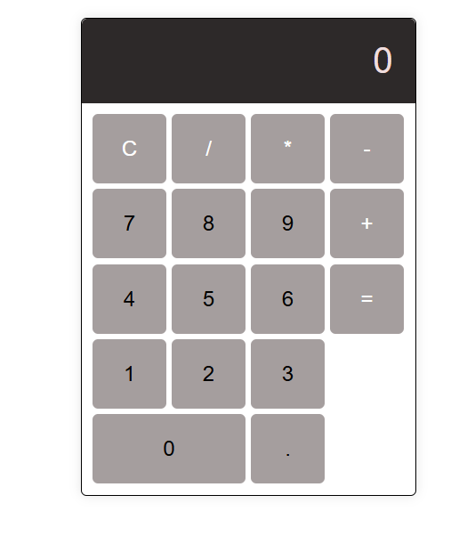

# codsoft


---

# 🌐 Web Projects Portfolio

This repository contains a collection of my web development projects built with **HTML, CSS, and JavaScript**.

## 📂 Projects Included

### 1. Personal Portfolio

* **File:** `index.html` + `style.css`
* **Description:** A simple personal portfolio website showcasing my **skills, projects, resume, and contact details**.
* **Features:**

  * About Me section
  * Skills list
  * Projects showcase (Calculator & Landing Page)
  * Resume download link
  * Contact info

---

### 2. Job Finder Landing Page

* **File:** `index2.html` + `styles.css`
* **Description:** A landing page for a **job searching platform (Jinnyfy)**.
* **Features:**

  * Clean and responsive layout
  * Hero section with CTA button
  * Features section (Job updates, Easy applications, Detailed descriptions)
  * Contact section with email link

---

### 3. Basic Calculator

* **Files:** `index3.html` + `style2.css` + `script.js`
* **Description:** A **basic calculator** that performs simple arithmetic operations.
* **Features:**

  * Addition, Subtraction, Multiplication, Division
  * Clear button to reset values
  * Responsive design with styled buttons

---

## 🚀 How to Run

1. Clone the repository:

   ```bash
   git clone https://github.com/MohdZaman/codsoft.git
   ```
2. Open any project file (`index.html`, `index2.html`, `index3.html`) in your browser.

---

## 🖼️ Screenshots

### Portfolio


### Calculator



### Landing Page


---

## 🛠️ Technologies Used

* HTML5
* CSS3
* JavaScript

---

## 📧 Contact

* **Name:** Mohd Zaman
* **Email:** [razazaman7861@gmail.com](mailto:razazaman7861@gmail.com)
* **Phone:** 9258635761

---


